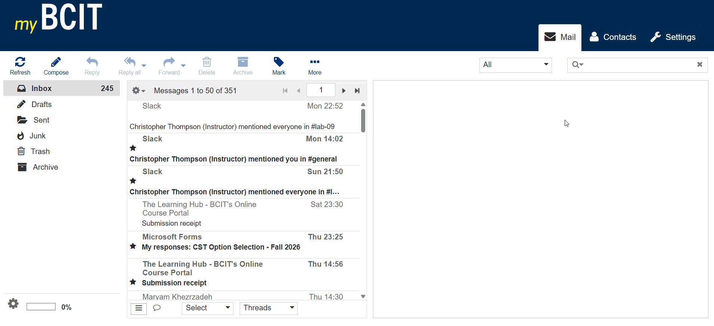
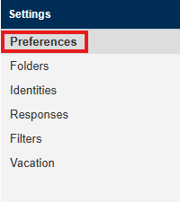
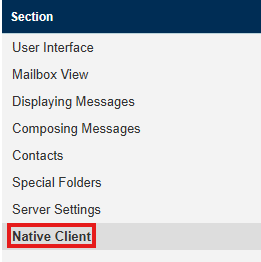
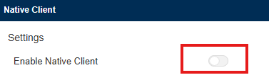
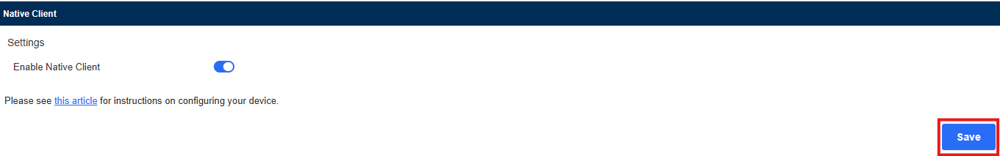
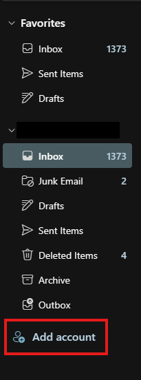
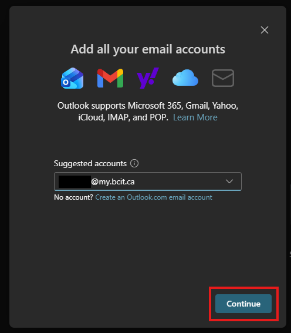
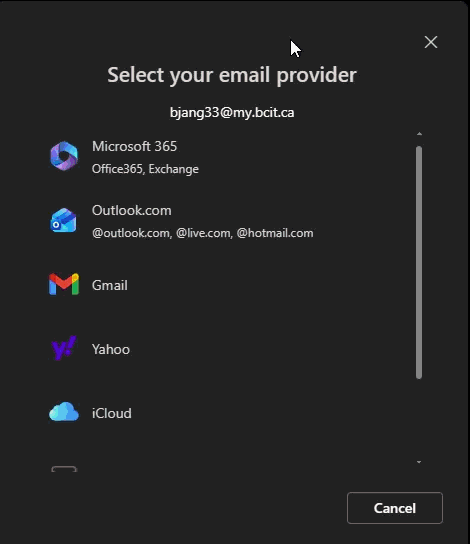
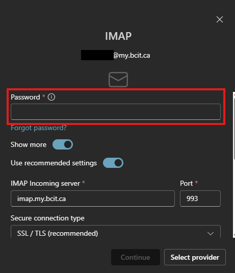
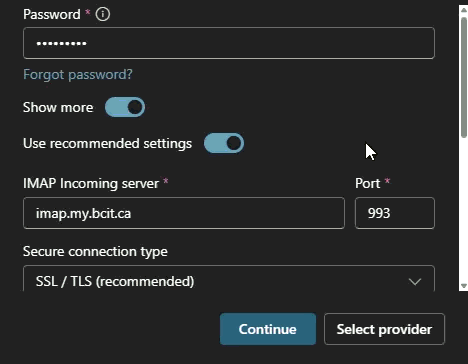

## **Overview**

An external email client is an email client that is not BCIT Webmail.

By setting up an external email client you can use a service like Microsoft Outlook to view and send emails from your BCIT Account.

You can set up multiple external email clients while still being able to use BCIT Webmail if you so choose.

## **Before you Begin**

This walkthrough will be assuming that your external email client of choice is ***Outlook***.

!!! warning
    ***Gmail will not work for this method of setting up an external client.***

## **Enable Native Client**

1. Sign in to your BCIT Email in Webmail.
2. Go to the **Settings** tab in the top right of the screen.

    === "Image"
        {width=300px}

    <!-- === "GIF"
        {width=600px} -->

3. Go to the settings section **Preferences**.

    === "Image"
        {width=300px}

4. Go to the Section **Native Client**.

    === "Image"
        {width=300px}

    !!! info
        Native Email clients are programs that handle emails as an standalone software installed on your device, as opposed to Webmail which is all handled in the browser.

5. Next to *Enable Native Client* click the slider.

    === "Image"
        {width=300px}

    !!! success
        The slider should be blue after you click it.

6. Click on the **Save** button.

    === "Image"
        {width=600px}

## **Configuring Outlook**

1. Click the **Add account** button in Outlook.

    === "Image"
        {width=150}

2. Under the *Suggested accounts* header, add your BCIT Email, then continue.

    === "Image"
        {width=300px}
3. Click the **IMAP** option in the list.

    === "GIF"
        {width=600px}

4. Under the *Password* header enter your BCIT Email password

    === "Image"
        {width=300px}

5. Ensure that the *IMAP Incoming server* is `imap.my.bcit.ca`, the *Port** is `993`, and the *Secure connection type* is `SSL / TLS`.
6. Ensure that your *SMTP username* is your BCIT Email.
7. Ensure that the *SMTP Outgoing server* is `smtp.my.bcit.ca` and the *Port* is `587`.

    !!! warning
        These should be the default values. If ***any*** of these are not the suggested values, correct them.

        === "GIF"
            

8. Under the *Secure connection type* change the value to `StartTLS`.

    !!! warning
        This will not be the default value, make sure to change it.

9. Press **Continue** twice.

## **Conclusion**

By the end of this guide, you will have successfully:

✅ Enabled usage of external email clients  
✅ Set up Outlook as an external email client

While this process is not quite nessasary, if you check your Webmail infrequently or forget to check your Webmail this can grant you easier access to emails sent to you.
