# How To Set Up Filters

- [How To Set Up Filters](#how-to-set-up-filters)
  - [**Overview**](#overview)
  - [**Filtering Submission Receipts**](#filtering-submission-receipts)
  - [**Conclusion**](#conclusion)


---

## **Overview**

Filters automatically sort your incoming emails based on rules you define. For example, moving all emails from a professor into a specific folder.

## **Filtering Submission Receipts**

Guess what? You can now get rid of the Submission Receipt clutter in your inbox!
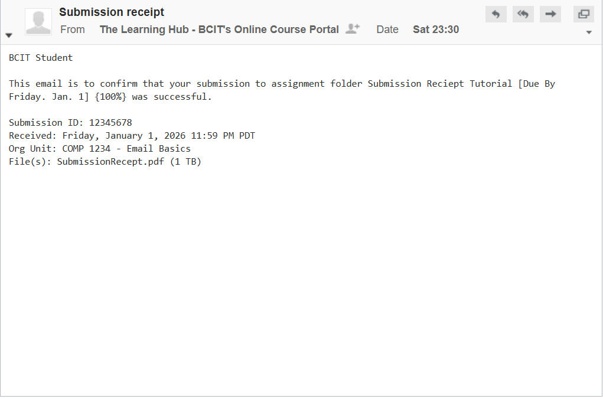
Here are the steps to get started!

1. Log into [MyBCIT](https://my.bcit.ca/)

2. Click **My Mail** in the top-right corner.

    === "Image"
        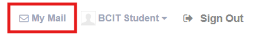

    === "Gif"
        <div class="tenor-gif-embed" data-postid="10659136198576665222" data-share-method="host" data-aspect-ratio="1" data-width="50%"><a href="https://tenor.com/view/cat-ouch-hammer-funny-cat-headache-gif-10659136198576665222">Cat Ouch GIF</a>from <a href="https://tenor.com/search/cat-gifs">Cat GIFs</a></div> <script type="text/javascript" async src="https://tenor.com/embed.js"></script>

3. In your myBCIT email, click **Settings** (top-right)

    === "Image"
        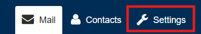

    === "Gif"
        <div class="tenor-gif-embed" data-postid="10659136198576665222" data-share-method="host" data-aspect-ratio="1" data-width="50%"><a href="https://tenor.com/view/cat-ouch-hammer-funny-cat-headache-gif-10659136198576665222">Cat Ouch GIF</a>from <a href="https://tenor.com/search/cat-gifs">Cat GIFs</a></div> <script type="text/javascript" async src="https://tenor.com/embed.js"></script>

4. Under **Settings**, select **Filters**.

    === "Image"
        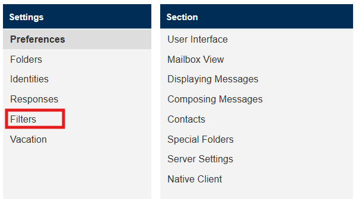

    === "Gif"
        <div class="tenor-gif-embed" data-postid="10659136198576665222" data-share-method="host" data-aspect-ratio="1" data-width="50%"><a href="https://tenor.com/view/cat-ouch-hammer-funny-cat-headache-gif-10659136198576665222">Cat Ouch GIF</a>from <a href="https://tenor.com/search/cat-gifs">Cat GIFs</a></div> <script type="text/javascript" async src="https://tenor.com/embed.js"></script>

5. Click + to add a new filter.

    === "Image"
        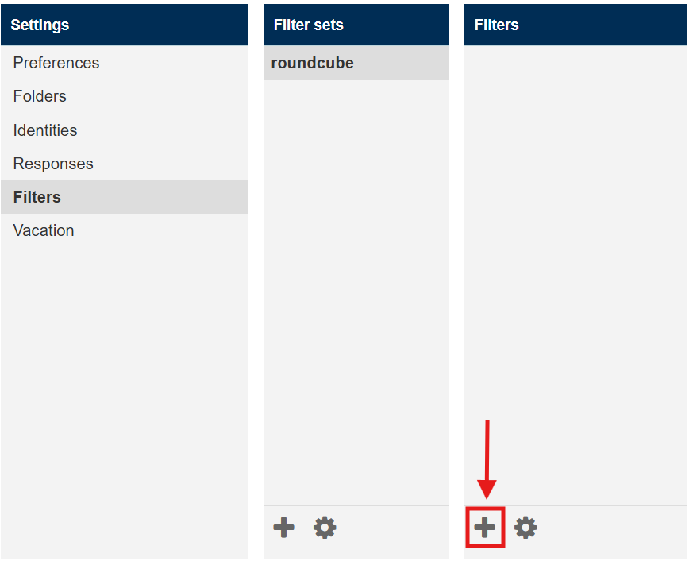

    === "Gif"
        <div class="tenor-gif-embed" data-postid="10659136198576665222" data-share-method="host" data-aspect-ratio="1" data-width="50%"><a href="https://tenor.com/view/cat-ouch-hammer-funny-cat-headache-gif-10659136198576665222">Cat Ouch GIF</a>from <a href="https://tenor.com/search/cat-gifs">Cat GIFs</a></div> <script type="text/javascript" async src="https://tenor.com/embed.js"></script>

    !!! info
        **roundcube** is the default filter set in your myBCIT email. This set is managed by the Roundcube webmail system, which is the standard interface for myBCIT email accounts. So don't worry about it!

6. Set **Filter Name**

    === "Image"
        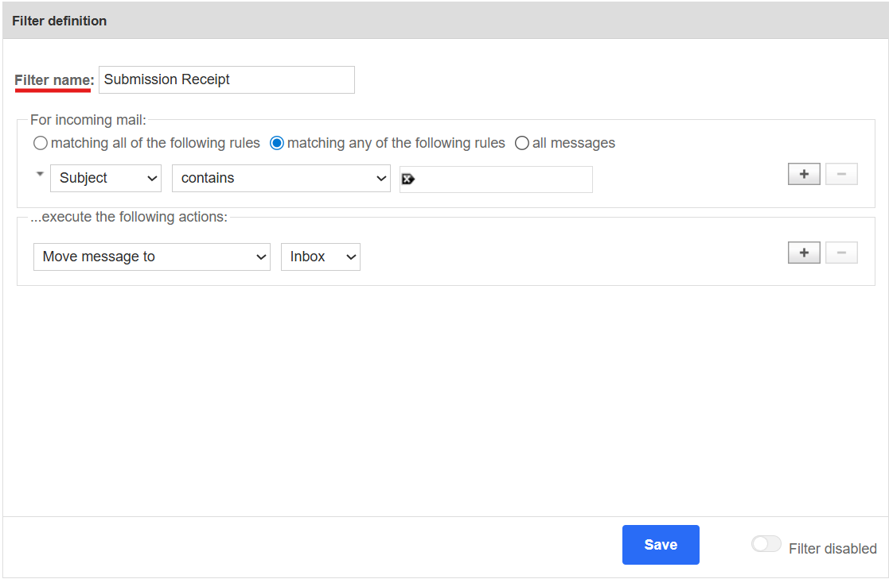

    === "Gif"
        <div class="tenor-gif-embed" data-postid="10659136198576665222" data-share-method="host" data-aspect-ratio="1" data-width="50%"><a href="https://tenor.com/view/cat-ouch-hammer-funny-cat-headache-gif-10659136198576665222">Cat Ouch GIF</a>from <a href="https://tenor.com/search/cat-gifs">Cat GIFs</a></div> <script type="text/javascript" async src="https://tenor.com/embed.js"></script>

7. Set your condition

    === "Image"
        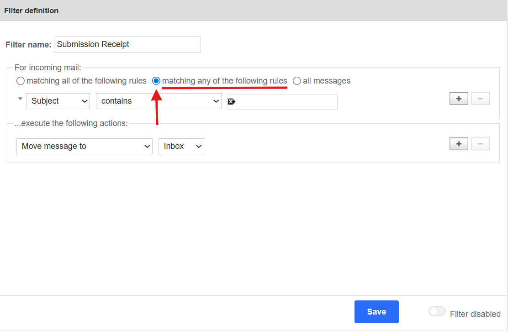

    === "Gif"
        <div class="tenor-gif-embed" data-postid="10659136198576665222" data-share-method="host" data-aspect-ratio="1" data-width="50%"><a href="https://tenor.com/view/cat-ouch-hammer-funny-cat-headache-gif-10659136198576665222">Cat Ouch GIF</a>from <a href="https://tenor.com/search/cat-gifs">Cat GIFs</a></div> <script type="text/javascript" async src="https://tenor.com/embed.js"></script>

    !!! info
        - **matching all of the following rules**: The email must meet *every* condition (AND)
        - **matching any of the following rules**: The email meets *at least one* condition (OR)
        - **all messages**: Applies to *every* incoming email, no conditions needed

8. Under **Subject**, select **From**

    === "Image"
        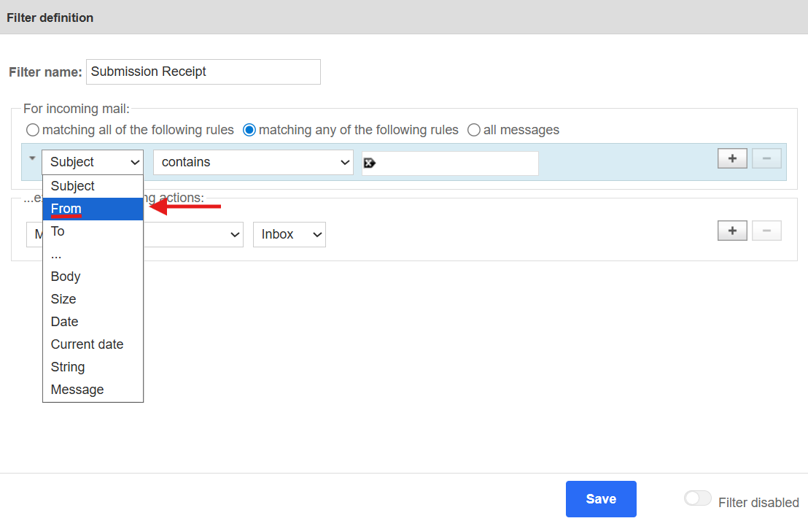

    === "Gif"
        <div class="tenor-gif-embed" data-postid="10659136198576665222" data-share-method="host" data-aspect-ratio="1" data-width="50%"><a href="https://tenor.com/view/cat-ouch-hammer-funny-cat-headache-gif-10659136198576665222">Cat Ouch GIF</a>from <a href="https://tenor.com/search/cat-gifs">Cat GIFs</a></div> <script type="text/javascript" async src="https://tenor.com/embed.js"></script>

9. Right of **contains** box, select the **text field** and insert:

    ```
    mail.learn.bcit.ca
    ```

    === "Image"
        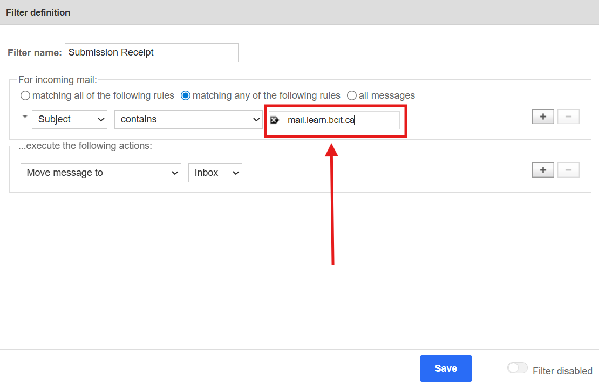

    === "Gif"
        <div class="tenor-gif-embed" data-postid="10659136198576665222" data-share-method="host" data-aspect-ratio="1" data-width="50%"><a href="https://tenor.com/view/cat-ouch-hammer-funny-cat-headache-gif-10659136198576665222">Cat Ouch GIF</a>from <a href="https://tenor.com/search/cat-gifs">Cat GIFs</a></div> <script type="text/javascript" async src="https://tenor.com/embed.js"></script>

    !!! info
        The original address is "The Learning Hub - BCIT's Online Course Portal no-reply@mail.learn.bcit.ca". 
        
        However, using just the domain (mail.learn.bcit.ca) rather than the full address is more reliable. It'll catch all emails from The Learning Hub regardless of any minor sender variations.

10. Under **Inbox**, select **Archive**

    === "Image"
        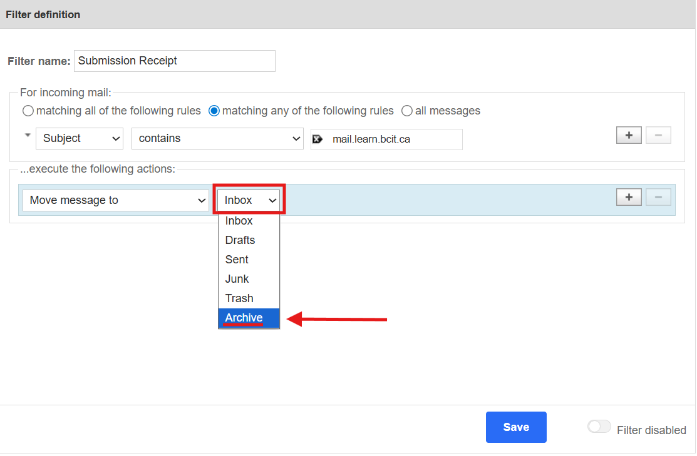

    === "Gif"
        <div class="tenor-gif-embed" data-postid="10659136198576665222" data-share-method="host" data-aspect-ratio="1" data-width="50%"><a href="https://tenor.com/view/cat-ouch-hammer-funny-cat-headache-gif-10659136198576665222">Cat Ouch GIF</a>from <a href="https://tenor.com/search/cat-gifs">Cat GIFs</a></div> <script type="text/javascript" async src="https://tenor.com/embed.js"></script>

    !!! warning
        Make sure the **Filter disabled** toggle in the bottom-right is off so your filter is active.

11. Once ready, click **Save**

    === "Image"
        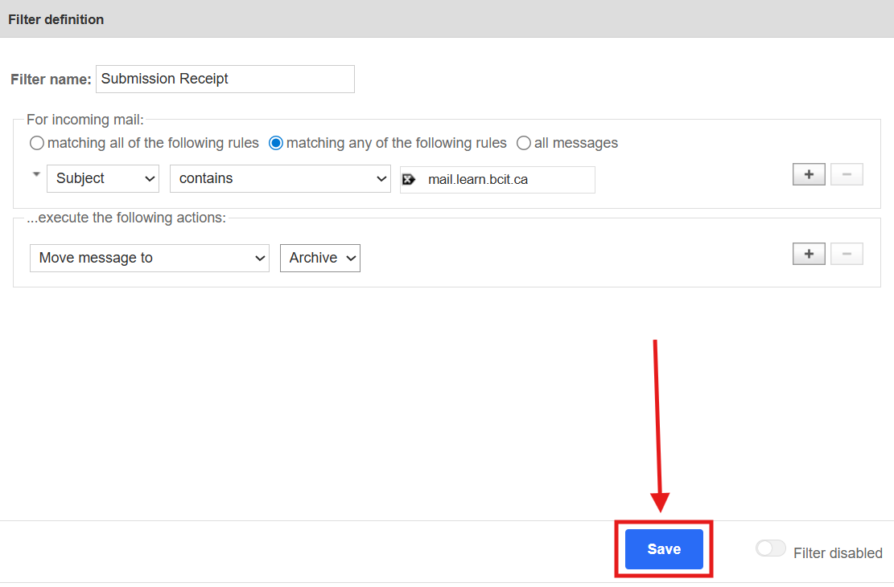

    === "Gif"
        <div class="tenor-gif-embed" data-postid="10659136198576665222" data-share-method="host" data-aspect-ratio="1" data-width="50%"><a href="https://tenor.com/view/cat-ouch-hammer-funny-cat-headache-gif-10659136198576665222">Cat Ouch GIF</a>from <a href="https://tenor.com/search/cat-gifs">Cat GIFs</a></div> <script type="text/javascript" async src="https://tenor.com/embed.js"></script>

!!! success
    Congratulations! You have successfully uncluttered your inbox with one of many filters!

    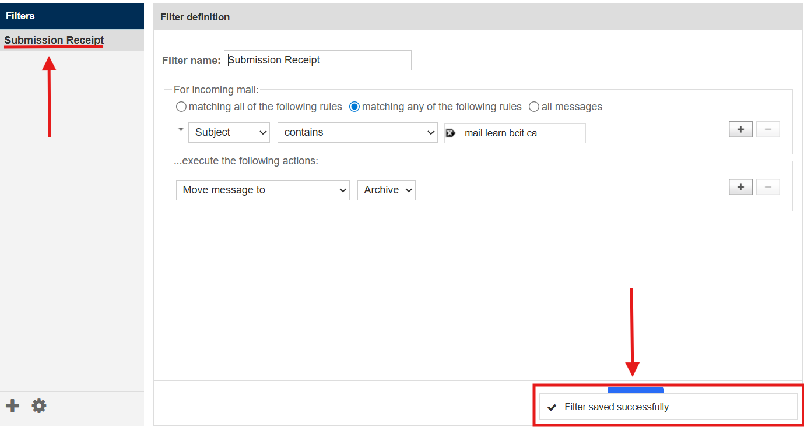

## **Conclusion**

By completing this tutorial, you have successfully:

- ✅ Created a filter in your myBCIT webmail
- ✅ Set a rule to identify emails from The Learning Hub
- ✅ Configured an action to automatically move them out of your inbox

You may go onto the next tab to learn how to take advantage of your email!