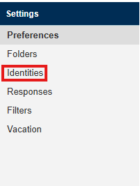
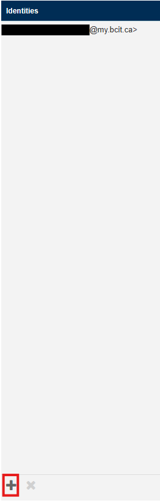
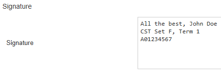

## **Overview**

An identity is a kind of profile that contains your name, email address, organization and signature, while also allowing you to set automatic fowarding to different emails.

A signature is a footer automatically placed at the end of every email you send.

## **Add An Identity**

1. Sign in to your BCIT Email in Webmail.
2. Go to the **Settings** tab in the top right of the screen.

    === "Image"
        {width=300px}

3. Go to the settings section **Identities**.

    === "Image"
        {width=300px}

4. Click on the **Plus (+)** button in the bottom of the screen, underneath the *Identities* tab.

    === "Image"
        {width=150px}

## **Adding Information**

1. Set your **Display Name**, your display name should be your real name (i.e. `John Doe`).
2. Set your **Email**, this should be your BCIT email.
3. Set your **Organization** (i.e. `BCIT`).
4. Click the **Set default** slider.

    !!! info
        This will set this identity as the default one used by your emails.

5. Set your **Signature**, this will be put at the end of every email. This can be whatever you want it to be, however it should give important information about you, i.e.  

    ```
    --
    Thanks, John Doe  
    CST Set A, Term 1  
    A01234567
    ```  

    !!! success
        It should look something like this:
        === "Image"
            {width=600px}

6. Click on the **Save** button.

## **Conclusion**

By the end of this guide you will have successfully:

✅ Added an identity to be used for your emails  
✅ Added a signature to be placed at the end of your emails