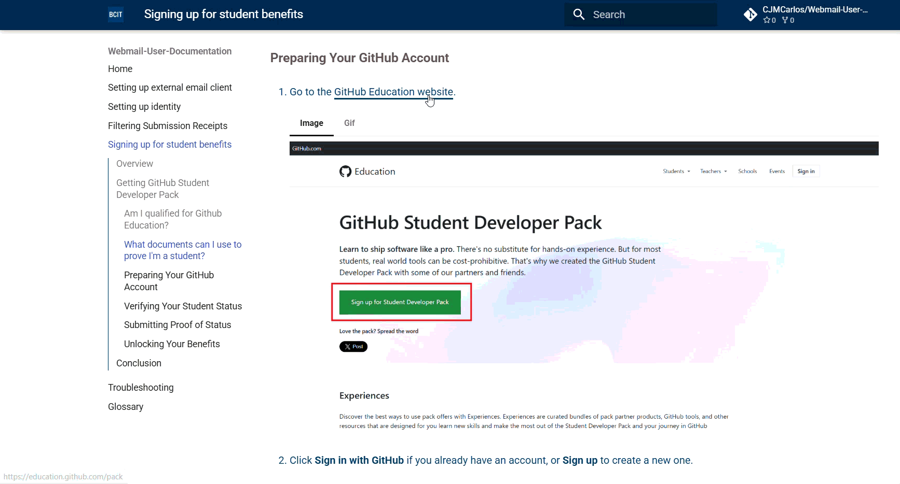

## **Overview**

The GitHub Student Developer Pack is a collection of free tools and services provided by GitHub for students. It includes free GitHub Pro, access to educational resources, cloud credits, and more. As a BCIT student, you're eligible to claim these valuable benefits.

Ready to unlock free developer tools? The GitHub Student Developer Pack includes everything from GitHub Pro to cloud credits and design tools!

---

## **Before You Begin**

### **Am I qualified for Github Education?** {.subheader}

You qualify for Github Education if you:

- Are enrolled in a degree- or diploma-granting program, such as a high school, college, university, or homeschool.
- Have a verifiable school-issued email or documents proving your student status.
- Own a [GitHub personal account](https://docs.github.com/en/get-started/start-your-journey/creating-an-account-on-github).
- Are at least 13 years old.

### **What documents can I use to prove I'm a student?** {.subheader}

- A picture of your school ID with current enrollment date
- Your class schedule
- Your transcript
- An affiliation or enrollment verification letter

---

## **Preparing Your GitHub Account**

1. Go to the [GitHub Education website](https://education.github.com/pack).

    === "Image"
        

    === "Gif"
        {width=600px}

2. Click **Sign in with GitHub** if you already have an account, or **Sign up** to create a new one.

    !!! info "Creating a New Account"
        If you're creating a new account, make sure to use your **BCIT email address** to verify your student status later.

3. Complete the GitHub account setup if you're new to the platform.

    !!! warning
        Make sure you **_completed_** your GitHub billing information with your full name exactly as it appears in your academic affiliation document. You do not have to add a payment method. You may need to log out and log back in to GitHub before reapplying. If you have only a single legal name, enter it in both the first and last name fields.

## **Verifying Your Student Status**

4.  Once logged in, click the **Start an application** button.

    

5.  Complete the form.

    {width=400px}

6.  Select **Share Location** then press **Continue**.

    !!! success
        The **Share Location** button should look like this if successful

        {width=400px}

## **Submitting Proof of Enrollment**

7.  Select your method of verification.

    {width=400px}

    !!! info "Acceptance Rates"
        How likely each document is to be accepted:

        - **Good** - Most likely to be accepted
        - **Fair** - May be accepted
        - **Poor** - Less likely to be accepted

8.  Upload proof of enrollment, then click **Continue**

    {width=400px}

9.  Wait a few days for approval. Make sure to check your BCIT email for an acceptance/rejection email.

!!! success
    Congratulations! Your approval email/status will look like this

    {width=700px}

    {width=700px}

## **Unlocking Your Benefits**

10. Return to [Education Benefits](https://github.com/settings/education/benefits) after confirming your email.

11. Your application type should now show as **Student**. Explore the available benefits listed on the page.

    

## **Conclusion**

By the end of this guide, you will have successfully:

✅ Created or signed into your GitHub account  
✅ Verified your student status with your BCIT email  
✅ Unlocked access to the GitHub Student Developer Pack  
✅ Gained access to free premium tools and services

The GitHub Student Developer Pack provides incredible value during your time at BCIT. Take advantage of tools like GitHub Pro, cloud credits, design software, and more. These resources will enhance your learning and development skills throughout your studies.

For more information about individual benefits and how to use them, visit the [GitHub Education website](https://education.github.com/pack).
